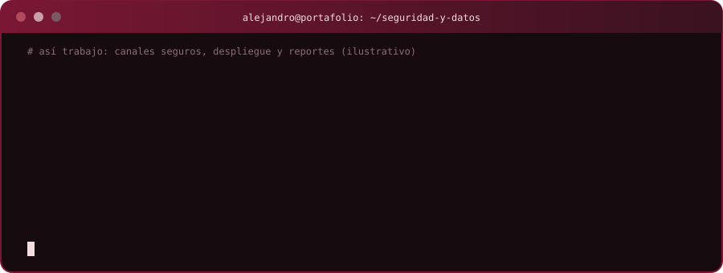

  
  
  
  

---

## Sobre mí

Estudiante de **Ingeniería de Sistemas e Industrial** en la Universidad de los Andes, próximo a graduarme. Me interesa que los datos y los procesos se traduzcan en decisiones: reportes automáticos, análisis con Excel y SQL, y software que se despliega, se mide y se protege.

<table>
  <tr>
    <td width="33%" valign="top">
      <h4>Datos y procesos</h4>
      Excel y Power Query, SQL, Power BI. Limpieza, consolidación y reportes que se actualizan solos.
    </td>
    <td width="33%" valign="top">
      <h4>Software y nube</h4>
      APIs con FastAPI, contenedores con Docker, infraestructura como código en AWS, apps con Angular y Android.
    </td>
    <td width="33%" valign="top">
      <h4>Seguridad</h4>
      Criptografía aplicada (RSA, Diffie-Hellman, AES, HMAC), disponibilidad e inyección de fallos, control de acceso en APIs. Área en la que sigo formándome.
    </td>
  </tr>
</table>

  

---

## Proyectos destacados

<table>
  <tr>
    <td width="50%" valign="top">
      <h3><a href="https://github.com/Alejob12/FiscalIA-langing-page">FiscalIA</a></h3>
      Sitio, API y panel CRM para una propuesta de automatización contable. Lo diseñé y desarrollé de punta a punta.  
      
      
      
    </td>
    <td width="50%" valign="top">
      <h3><a href="https://github.com/Alejob12/ASR_Disponibilidad">ASR Disponibilidad</a></h3>
      Validación experimental de disponibilidad en AWS: infraestructura como código, pruebas de carga con 75 usuarios e inyección de fallos.  
      
      
      
    </td>
  </tr>
  <tr>
    <td width="50%" valign="top">
      <h3><a href="https://github.com/Alejob12/dona-vida-app-mobile">Dona Vida</a></h3>
      App Android nativa de 43 pantallas construida a partir de mockups de Figma.  
      
      
      
    </td>
    <td width="50%" valign="top">
      <h3><a href="https://github.com/Alejob12/Caso-3">Caso 3</a></h3>
      Protocolo seguro cliente-servidor con medición de desempeño: RSA, Diffie-Hellman, AES y HMAC.  
      
      
    </td>
  </tr>
  <tr>
    <td width="50%" valign="top">
      <h3><a href="https://github.com/Alejob12/Taller-3-DPOO">Taller 3 DPOO</a></h3>
      Modelo orientado a objetos de una aerolínea con tarifas por temporada, vuelos, clientes y persistencia JSON.  
      
      
    </td>
    <td width="50%" valign="top">
      <h3><a href="https://github.com/Alejob12/mynewapp">mynewapp</a></h3>
      Lista de series con detalle, promedio y pruebas unitarias.  
      
      
    </td>
  </tr>
</table>

---

## Herramientas

  

  
  
  

---

## Actividad en GitHub

  
  

  

  

  

---

## Contacto

  
  

 

  

